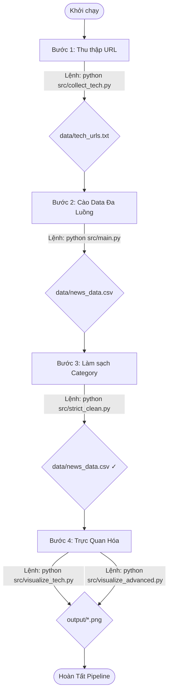

# Tài Liệu Kiến Trúc Kỹ Thuật: Hệ Thống Thu Thập Dữ Liệu Báo Chí Chuyên Mục Công Nghệ (Tech News Data Pipeline)

Tài liệu này cung cấp cái nhìn toàn diện và chi tiết về mặt kỹ thuật của hệ thống pipeline thu thập dữ liệu tự động, được thiết kế tối ưu để khai thác bộ dữ liệu **Tin tức Công nghệ (Technology News Dataset)** từ 3 tòa soạn điện tử lớn nhất Việt Nam: **VnExpress, VietNamNet, và Thanh Niên**.

Mục tiêu chiến lược của hệ thống là xây dựng một kho dữ liệu chuyên sâu gồm **~20.000 bài viết**, đảm bảo tính toàn vẹn, loại bỏ trùng lặp và đạt tỷ lệ cân bằng nghiêm ngặt giữa các nguồn báo để phục vụ trực tiếp cho các bài toán Khai thác dữ liệu (Data Mining), Xử lý ngôn ngữ tự nhiên (NLP), và Phân tích xu hướng công nghệ (Trend Analysis).

---

## Cấu Trúc Thư Mục

```
btl/
├── README.md                        # Tài liệu kỹ thuật
├── Kich_Ban_Thuyet_Trinh.md         # Kịch bản demo thuyết trình
├── requirements.txt                 # Danh sách thư viện Python
├── .gitignore                       # Cấu hình Git
│
├── src/                             # ═══ SOURCE CODE CHÍNH ═══
│   ├── models.py                    #   Định nghĩa Article dataclass (22 trường)
│   ├── scrapers.py                  #   BaseScraper + các scraper con (VnExpress, VietNamNet, ThanhNien...)
│   ├── collect_tech.py              #   Bước 1: Thu thập URL công nghệ
│   ├── main.py                      #   Bước 2: Cào dữ liệu đa luồng → CSV
│   ├── strict_clean.py              #   Bước 3: Làm sạch & chuẩn hóa category
│   ├── visualize_tech.py            #   Bước 4a: Biểu đồ cơ bản (domain bar, pie, subcategories)
│   └── visualize_advanced.py        #   Bước 4b: Biểu đồ nâng cao (tags, wordcloud, scatter)
│
├── data/                            # ═══ DỮ LIỆU ═══
│   ├── tech_urls.txt                #   Danh sách URL đã thu thập (~20K links)
│   ├── news_data.csv                #   Dữ liệu thô (Raw Data)
│   └── news_data_clean.csv          #   Dữ liệu đã làm sạch
│
└── output/                          # ═══ KẾT QUẢ TRỰC QUAN HÓA ═══
    ├── tech_domain_counts.png       #   Biểu đồ cột số bài theo domain
    ├── tech_domain_pie.png          #   Biểu đồ tròn phân bổ tỷ lệ
    ├── tech_subcategories.png       #   Top 15 sub-categories
    ├── advanced_top_tags.png        #   Top 20 tags phổ biến
    ├── advanced_tags_wordcloud.png  #   WordCloud tags
    ├── advanced_wordcount_dist.png  #   Phân phối độ dài bài viết
    ├── advanced_wordcount_domain.png#   So sánh độ dài theo domain
    ├── advanced_missing_values.png  #   Tỷ lệ dữ liệu khuyết thiếu
    └── advanced_scatter_plot.png    #   Scatter: tiêu đề vs nội dung
```

---

## Tổng Quan Luồng Hoạt Động (Data Pipeline Architecture)

Hệ thống vận hành theo mô hình ETL (Extract - Transform - Load) khép kín, tối ưu hóa từ bước định hướng URL đến bước trực quan hóa dữ liệu kiểm định chất lượng:

`[Chiến lược Target URLs] ➔ [Cân bằng Tỷ lệ Nguồn] ➔ [Cào Đa luồng & Sàng lọc HTML] ➔ [Ghi trực tiếp CSV Real-time] ➔ [Phân tích EDA]`

---

## 1. Khảo Sát & Chuẩn Hóa Mô Hình Dữ Liệu (`src/models.py`)

Hệ thống ứng dụng kiến trúc Object-Relational Mapping (ORM) thông qua thư viện SQLAlchemy để định nghĩa lớp `Article`. Việc chuẩn hóa này đảm bảo mọi bài viết từ các nguồn dữ liệu khác nhau (dù có cấu trúc DOM khác nhau) đều được quy hoạch về một lược đồ (schema) đồng nhất gồm 22 trường thông tin:

**Bảng tường minh lược đồ cơ sở dữ liệu (Schema Mapping)**

| Nhóm thông tin | Tên trường (Field) | Kiểu dữ liệu | Mô tả chi tiết |
| :--- | :--- | :--- | :--- |
| **Định danh & Định vị** | `article_id` | Integer | Khóa chính tự tăng. |
| | `url` | String | Đường dẫn duy nhất của bài báo (Unique Index). |
| | `domain` | String | Tên nguồn báo (vnexpress, vietnamnet, thanhnien). |
| **Nội dung cốt lõi** | `title` | String | Tiêu đề bài viết. |
| | `description` | Text | Tóm tắt đầu bài (Sapo). |
| | `main_content` | Text | Toàn bộ nội dung văn bản thuần đã loại bỏ thẻ HTML và quảng cáo. |
| | `author_name` | String | Tên tác giả hoặc nhóm phóng viên. |
| | `tags` | Text | Các từ khóa gắn kèm bài viết (dạng danh sách cách nhau bởi dấu phẩy). |
| **Phân loại & Thời gian** | `category` | String | Danh mục chính (mặc định: Công nghệ / Số hóa). |
| | `sub_category` | String | Chuyên mục con (Ví dụ: AI, Smartphone, Blockchain...). |
| | `published_time` | DateTime | Thời gian xuất bản gốc của bài báo. |
| | `scraped_time` | DateTime | Thời gian hệ thống thực hiện cào dữ liệu. |
| **Dữ liệu Đa phương tiện**| `thumbnail_url` | String | Ảnh đại diện của bài viết. |
| | `images` | Text | Danh sách URL tất cả các ảnh trong bài. |
| | `videos` | Text | Danh sách URL video tích hợp (nếu có). |
| **Bổ sung mở rộng** | Các trường metadata | Hỗ trợ | Các thông số cấu hình nội bộ và trạng thái xử lý lỗi. |

---

## 2. Chiến Lược Thu Thập URL Chuyên Ngành (`src/collect_tech.py`)

Để giải quyết bài toán thu thập trúng mục tiêu và tránh làm nhiễu tập dữ liệu bởi các chuyên mục khác, `collect_tech.py` triển khai **Chiến lược Phễu 3 Tầng (3-Tier Ingestion Strategy)** để đạt chỉ tiêu ~20.000 URLs:

*   **Tầng 1: Quét RSS Feeds (Real-time Ingestion):** Kéo các luồng tin tức mới nhất từ các RSS chuyên biệt như `vnexpress.net/rss/so-hoa.rss`, `vietnamnet.vn/rss/cong-nghe.rss`, và các nhánh ngách của Thanh Niên (game, blockchain, chuyển đổi số).
*   **Tầng 2: Duyệt Phân Trang Quá Khứ (Deep Historical Crawl):** Giải thuật tự động giả lập tham số phân trang (Pagination URL Pattern) để lùi sâu về lịch sử tuyến bài của các chuyên mục "Số hóa", "Khoa học" (VnExpress), "Công nghệ" (VietnamNet) và "Timeline Công nghệ" (Thanh Niên) qua hàng trăm trang.
*   **Tầng 3: Vét Dữ Liệu Bằng Từ Khóa (Keyword-Targeted Querying):** Hệ thống tích hợp một bộ ma trận từ khóa (Keywords Matrix) công nghệ chuyên sâu: *AI, trí tuệ nhân tạo, smartphone, blockchain, chatgpt, vệ tinh, vi xử lý, bán dẫn, 5G, cybersecurity...* Các truy vấn này được gửi trực tiếp qua API tìm kiếm nội bộ của từng báo để "vét" sạch bài viết ẩn.

**Thuật toán cân bằng dữ liệu (Data Balancing):**
Sau khi thu thập thô, hệ thống thực hiện đếm tần suất URL theo từng domain. Thuật toán sẽ lấy số lượng của báo có ít URL nhất làm mốc chuẩn ($N_{min}$), sau đó áp dụng phương pháp Lấy mẫu ngẫu nhiên không hoàn lại (Random Under-sampling) đối với các báo còn lại để cắt tỉa tập dữ liệu. Kết quả trả ra file `data/tech_urls.txt` đạt trạng thái cân bằng hoàn hảo.

---

## 3. Cào Dữ Liệu Chi Tiết Đa Luồng (`src/scrapers.py`, `src/main.py`)

Đây là trung tâm xử lý logic của toàn bộ pipeline, chịu trách nhiệm tải, bóc tách và làm sạch dữ liệu.

**Kiến trúc Đa hình (Polymorphism) trong Thiết kế Scraper:**
Hệ thống sử dụng mẫu thiết kế chuyên nghiệp: Định nghĩa một lớp trừu tượng `BaseScraper` chứa các hàm xử lý chung (tải HTML, cấu hình kết nối). Mỗi báo điện tử sẽ cấu hình một lớp con kế thừa để xử lý cấu trúc DOM đặc thù:
*   `VnExpressScraper`: Trích xuất dựa trên cấu trúc các thẻ article.fpt-article, bóc tách metadata từ thẻ JSON-LD.
*   `VietNamNetScraper`: Định vị nội dung qua các class content-main-detail, xử lý bẫy layout cũ/mới của tòa soạn.
*   `ThanhNienScraper`: Sử dụng CSS Selectors bóc tách cấu trúc nội dung dạng khối (block).

```text
                 ┌─────────────────┐
                 │   BaseScraper   │
                 └────────┬────────┘
                          │
        ┌─────────────────┼─────────────────┐
        ▼                 ▼                 ▼
┌──────────────────┐┌──────────────────┐┌──────────────────┐
│ VnExpressScraper ││ VietNamNetScraper││ ThanhNienScraper │
└──────────────────┘└──────────────────┘└──────────────────┘
```

**Cơ chế Phòng vệ & Chống chặn (Anti-Bot & Fault Tolerance):**
*   **User-Agent Rotation:** Liên tục thay đổi chuỗi định danh trình duyệt ngẫu nhiên để vượt qua Firewall.
*   **Adaptive Jitter Delay:** Chèn khoảng trễ ngẫu nhiên từ 0.1 đến 0.4 giây giữa các request để giả lập hành vi người dùng thật.
*   **Fault Isolation:** Logic bóc tách được bao bọc bằng khối try-except. Lỗi (404, Timeout) được ghi nhận và bỏ qua, đảm bảo tiến trình không bị gián đoạn.

**Tối ưu hóa Hiệu năng bằng Đa Luồng (Concurrency):**
Tại `src/main.py`, hệ thống triển khai `concurrent.futures.ThreadPoolExecutor` (15 workers). Tốc độ thu thập tăng gấp 5 - 10 lần nhờ cơ chế xử lý I/O Bound đồng thời.

---

## 4. Lưu Trữ Dữ Liệu Trực Tiếp (Real-time CSV Streaming)

Để giải quyết triệt để bài toán thắt cổ chai I/O (I/O Bound) và tránh tình trạng khóa cơ sở dữ liệu (DB Locks) khi cào đa luồng cường độ cao, kiến trúc hệ thống đã được tối ưu hóa ở khâu lưu trữ:

*   Hệ thống bỏ qua bước lưu trữ trung gian mà mở luồng **ghi trực tiếp (Append Mode)** liên tục xuống file phẳng `data/news_data.csv`. 
*   Dữ liệu được mã hóa chuẩn `utf-8-sig` ngay trong tiến trình cào. Cơ chế streaming real-time này đảm bảo dữ liệu luôn được an toàn lưu trên ổ cứng ngay cả khi tiến trình bị ngắt đột ngột, đồng thời sẵn sàng tương thích 100% với môi trường Pandas/Scikit-learn để training model mà không cần các bước export cồng kềnh.

---

## 5. Khám Phá & Trực Quan Hóa Đánh Giá Bộ Dữ Liệu (EDA - `src/visualize_tech.py`, `src/visualize_advanced.py`)

Nhằm mục đích kiểm thử (Quality Assurance) và khám phá tri thức sơ bộ trên bộ dữ liệu vừa cào, hệ thống tích hợp module EDA tự động sử dụng thư viện **Pandas** phối hợp cùng **matplotlib**:

*   **Đánh giá độ cân bằng nguồn (Data Balance Metric):** Xuất ra biểu đồ cột và biểu đồ tròn (`output/tech_domain_*.png`). Kỹ sư dữ liệu có thể dễ dàng xác minh trực quan tỷ lệ đóng góp của VnExpress, VietNamNet và Thanh Niên có duy trì ở mức cân bằng hoàn hảo ~33.3% hay không.
*   **Phân tích Xu hướng Chủ đề Phụ (`output/tech_subcategories.png`):** Tự động đếm tần suất và vẽ biểu đồ thanh cho Top 15 chuyên mục con (Sub-categories) xuất hiện nhiều nhất.
*   **Phân tích nâng cao (`output/advanced_*.png`):** WordCloud, phân phối độ dài nội dung, tỷ lệ missing values, và scatter plot so sánh tiêu đề-nội dung.

---

## 🚀 Hướng Dẫn Vận Hành Hệ Thống

Để khởi chạy quy trình thu thập từ A đến Z, kích hoạt môi trường Python ảo và chạy tuần tự các lệnh sau:



**1. Gom Links:** `python src/collect_tech.py`
**2. Cào Dữ Liệu:** `python src/main.py`
**3. Làm Sạch:** `python src/strict_clean.py`
**4. Vẽ Biểu Đồ:** `python src/visualize_tech.py && python src/visualize_advanced.py`
